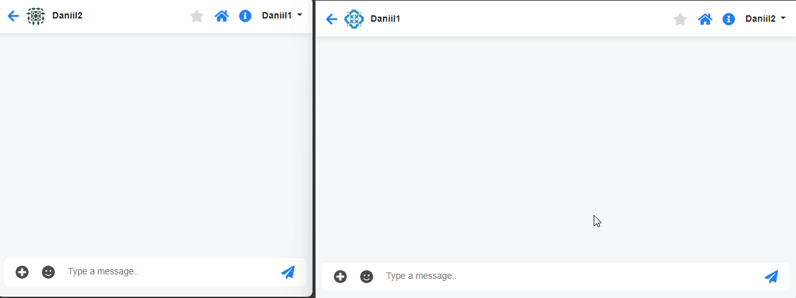

# Описание проекта: Live Chat
Live Chat, разработанный на Laravel 8 с использованием PHP 7.4. Основная цель — предоставить функциональность чата в реальном времени с поддержкой каналов для различных пользователей. 

_В настоящее время реализован только система мгновенной отправки/доставки сообщений._

### Стек технологий:
- **Laravel 8**
- **PHP 7.4**
- **Pusher**
- **Chatify** 

### Функциональность:
Чат с поддержкой нескольких пользователей.
Использование WebSocket для мгновенной передачи сообщений.

### Установка и настройка:
#### Склонируйте репозиторий:

```bash
git clone https://github.com/DaniillGolovin/Live-chat.git
```

#### Установите зависимости:

```bash
composer install
npm install
npm run dev
```

#### Настройте файл .env

```dotenv
DB_CONNECTION=mysql
DB_HOST=db
DB_PORT=3307
DB_DATABASE=laravel
DB_USERNAME=user
DB_PASSWORD=root

# Укажите параметры подключения к Pusher (берется из аккаунта)
PUSHER_APP_ID=*****
PUSHER_APP_KEY=********************
PUSHER_APP_SECRET=********************
PUSHER_APP_CLUSTER=eu
```

#### Соберите и запустите проект:

```bash
docker-compose up -d --build
docker exec -it project_app php artisan migrate
```

_(если возникает ошибка permission denied к storage => sudo chmod 777 -R storage)_

#### Особенности:
Реализация с использованием Pusher и Chatify значительно упрощает создание чата с поддержкой реального времени.
Возможность расширения и модификации функционала чата для интеграции с другими сервисами или приложениями.

#### Требования:
- PHP >= 7.4
- Composer
- Pusher аккаунт

#### Демонстрация:

